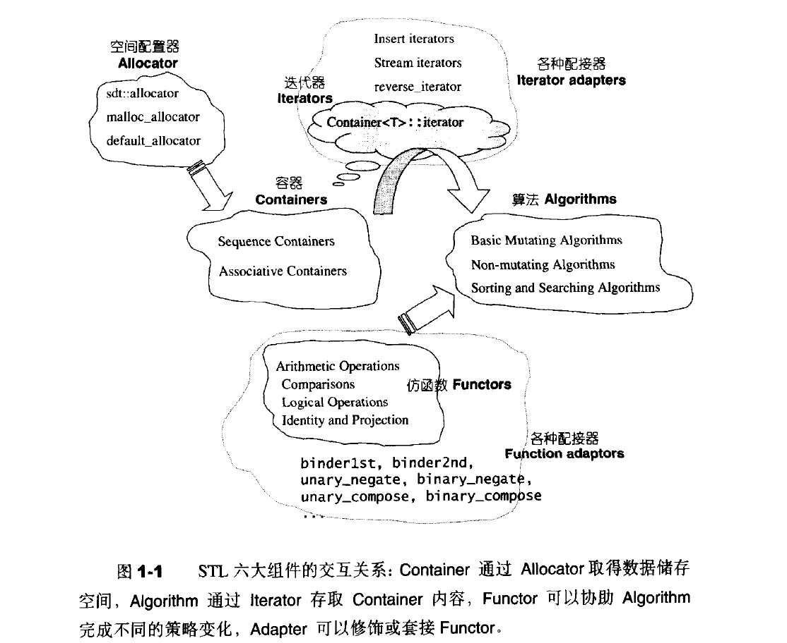

## 1.2 STL六大组件 功能与运用

STL 提供六大组件，彼此可以组合套用：

1. **容器 ( containers )** ：各种数据结构，如 vector，list，deque，set，map，用来存放数据，详见本书4，5两章。从实现的角度来看，STL 容器是一种 class template。就体积而言，这一部分很像冰山在海面下的比率。
2. **算法 ( algorithms )** ：各种常用算法如 sort，search，copy，erase… 详见第 6 章。从实现的角度来看，STL 算法是一种 function template。
3. **迭代器（ iterators )** ：扮演容器与算法之间的胶合剂，是所谓的“泛型指针”，详见第 3 章。共有五种类型，以及其它衍生变化。从实现的角度来看，迭代器是一种将 operator* , operator->, operator++, operator-- 等指针相关操作予以重载的 class termplate。所有 STL 容器都附带有自己专属的迭代器——是的，只有容器设计者才知道如何遍历自己的元素。原生指针（native pointer）也是种迭代器。
4. **仿函数 ( functors )** ：行为类似函数，可作为算法的某种策略( policy )，详见第 7 章。从实现的角度来看，仿函数是一种重载了operator() 的 class 或 class template。一般函数指针可视为狭义的仿函数。
5. **配接器 ( adapters )** ：一种用来修饰容器（ containers）或仿函数（ functors ) 或迭代器 ( iterators）接口的东西，详见第 8 章。例如，STL 提供的 queue 和 stack，虽然看似容器，其实只能算是一种容器配接器，因为它们的底部完全借助 deque，所有操作都由底层的 deque 供应。改变 functor 接口者，称为 function adapter；改变 container 接口者，称为 container adapter；改变 iterator 接口者，称为 iterator adapter。配接器的实现技术很难一言以蔽之，必须逐一分析，详见第 8 章。
6. **配置器 ( allocators)** ：负责空间配置与管理，详见第 2 章。从实现的角度来看，配置器是一个实现了动态空间配置、空间管理、空间释放的 class template。

**图 1-1 显示了六大组件交互关系。**

