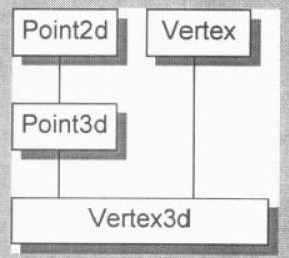
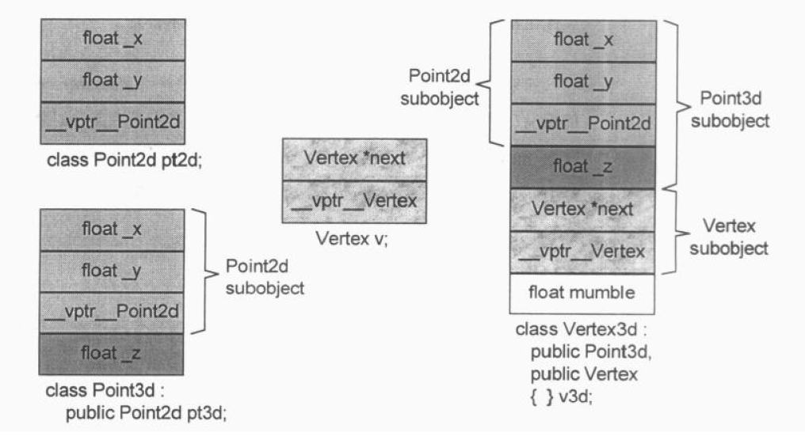
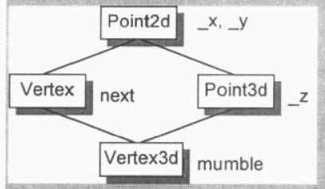
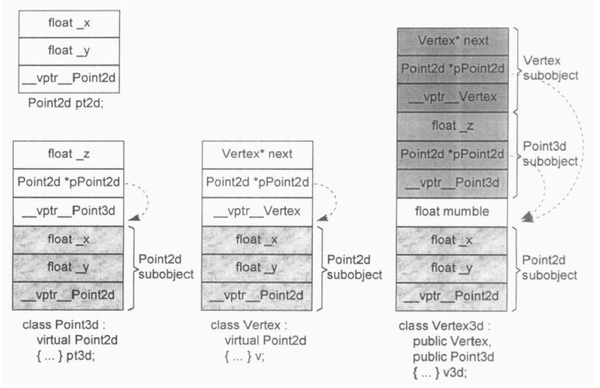

## 第 3 章  Data 语意学（The Semantics of Data）

下面这个类大小：

```cpp
class X { };
class Y : public virtual X { };
class Z : public virtual X { };
class A : public Y, public Z { };

int main()
{
    cout << "X : " << sizeof(X) << endl;
    cout << "Y : " << sizeof(Y) << endl;
    cout << "Z : " << sizeof(Z) << endl;
    cout << "A : " << sizeof(A) << endl;

    return 0;
}
```

不同的编译器可能不同，在 Windows 和 Ubuntu 上测试，结果如下：

```cpp
X : 1
Y : 8
Z : 8
A : 16
```

解释一下：

- **X : 1**：事实上 X 并不是空的，它有一个隐晦的 1 byte 大小，那是被编译器安插进去的一个char。这使得这个class 的 objects 得以在内存中配置独一无二的地址；
- **Y : 8，Z : 8**：虚继承了 X，各有一个指针指向 X；
- **A : 16**：A 继承自 Y，Z，含有两个指针分别指向X，Y。

C++ 对象模型尽量以空间优化和存取速度优化的考虑来表现 nonstatic datamembers，并且保持和 C 语言 struct 数据配置的兼容性。它把数据直接存放在每一个 class object 之中。对于继承而来的 nonstatic data members (不管是 virtual 或 nonvirtual base class) 也是如此。不过并没有强制定义其间的排列顺序。至于 staticdata members，则被放置在程序的一个 global data segment 中，不会影响个别的 class object 的大小。在程序之中，不管该 class 被产生出多少个 objects (经由直接产生或间接派生），static data members 永远只存在一份实体（译注：甚至即使该 class 没有任何 object 实体，其 static data members 也已存在）。但是一个 template class 的 static data members 的行为稍有不同，7.1 节有详细的讨论。


### 3.1  Data Member 的绑定（The Binding of a Data Member）

```cpp
typedef int length;

class Point3d
{
public:
	// 喔欧:length被决议（resolved）为global
	// 没问题:_va1被决议（resolved)为Point3d::_val
    void mumble(1ength val) { _val = val; )
	length mumble() { return _val; }

private:
	// length必须在“本class 对它的第一个参考操作”之前被看见
    // 这样的声明将使先前的参考操作不合法
	typedef float length;
	length _val;
};
```

在类内 mumble 中的参数类型 1ength 是使用的全局声明的 length（int），而不是类内声明的 length（float），如果要用类内声明的 1ength 需要将 1ength 定义在类前面，即在函数 mumble 前面定义，让函数 mumble 能够看到类内定义的 1ength。

上面这种重新声明的类型（typedef int length）会产生这样的效果，但平常的类型不会这样，比如内置类型 int、double 等。


### 3.2  Data Member 的布局（Data Member Layout）

Nonstatic data members 在 class object 中的排列顺序将和其被声明的顺序一样，当前各家编译器都是把一个以上的 access sections （也就是 private、public、protected 等区段）连锁在一起，依照声明的次序，成为一个连续区块。

vptr 会被放在什么位置呢？传统上它被放在所有明确声明的 members 的最后。不过如今也有一些编译器把 vptr 放在一个 class object 的最前端。


### 3.3  Data Member 的存取

**Static Data Members**

Static data members，按其字面意义，被编译器提出于 class 之外，被视为一个 global 变量（但只在 class 生命范围之内可见）。每一个 member 的存取许可（译注: private 或 protected 或 public )，以及与 class 的关联，并不会导致任何空间上或执行时间上的额外负担。

每一个 static data member 只有一个实体，存放在程序的 data segment 之中。每次程序参阅〔取用）static member，就会被内部转化为对该唯一的 extern 实体的直接参考操作。

member 其实并不在 class object 之中，因此存取 static members 并不需要通过 class object。

如果 Static data members 是一个从复杂继承关系中继承而来的 member，或者是一个 “virtual base class 的virtual base class” (或其它同等复杂的继承结构）的 member ，那无关紧要，程序之中对于 static members 还是只有唯一个实体，而其存取路径仍然是那么直接。

如果有两个 classes，每一个都声明了一个 static member freeList，那么当它们都被放在程序的 data segment时，就会导致名称冲突。编译器的解决方法是暗中对每一个 static data member 编码以获得一个独一无二的程序识别代码。


**Nonstatic Data Members**

欲对一个 nonstatic data member 进行存取操作，编译器需要把 class object 的起始地址加上 data member 的偏移量（offset )。每一个 nonstatic data member 的偏移量（ offset ）在编译时期即可获知。

虚拟继承将为 “经由 base class subobject 存取 class members ”导人一层新的间接性。

但如果 nonstatic data member 是一个 virtual base class 的 member，存取速度会比较慢一点。下面的例子：

```cpp
origin.x = 0.0;
pt->x = 0.0;
```

> “从 origin 存取” 和 “从 pt 存取” 有什么重大的差异？

答案是 “当 Point3d 是一个 derived class，而在其继承结构中有一个 virtual base class，并且被存取的 member （如本例的x）是一个从该 virtual base class 继承而来的 member 时，就会有重大的差异”。这时候我们不能够说 pt 必然指向哪一种 class type (因此我们也就不知道编译时期这个 member 真正的 offset 位置)，所以这个存取操作必须延迟至执行期，经由一个额外的间接导引，才能够解决。但如果使用 origin，就不会有这些问题，其类型无疑是 Point3d class，而即使它继承自 virtual base class，members 的 offset 位置也在编译时期就固定了。一个积极进取的编译器甚至可以静态地经由 origin 就解决掉对 x 的存取。


### 3.4  ”继承“ 与 Data Member

#### 只要继承不要多态（Inheritance without Polymorphism）

```cpp
class Concrete
{
public:
    // ...
private:
    int val;
    char c1;
    char c2;
    char c3;
};

class Concrete1
{
public:
    // ...
private:
    int val;
    char bit1;
};

class Concrete2 : public Concrete1
{
public:
    // ...
private:
    char bit2;
};

class Concrete3 : public Concrete2
{
public:
    // ...
private:
    char bit3;
};

int main()
{
    cout << "Concrete : " << sizeof(Concrete) << endl;		// 8
    cout << "Concrete1 : " << sizeof(Concrete1) << endl;	// 8
    cout << "Concrete2 : " << sizeof(Concrete2) << endl;	// 8
    cout << "Concrete3 : " << sizeof(Concrete3) << endl;	// 8

    return 0;
}
```

上述代码测试结果均为 8，与书中内容不一致，可能现在的编译器优化了吧。


#### 加上多态（Adding Polymorphism）

> 当一个类加上虚函数后，哪些地方会发生变换？

- 导入一个和该类有关的 virtual table，用来存放它所声明的每一个 virtual functions 的地址。这个 table 的元素数目一般而言是被声明的 virtual functions 的数目，再加上一个或两个 slots（用以支持 runtime type  identification)。
- 在每一个 class object 中导入一个 vptr，提供执行期的链接，使每一个 object 能够找到相应的 virtual table。
- 加强 constructor，使它能够为 vptr 设定初值，让它指向 class 所对应的 virtual table。这可能意味着在 derived class 和每一个 base class 的 constructor 中，重新设定 vptr 的值。
- 加强 destructor，使它能够抹消 “指向 class 之相关 virtual table” 的 vptr。要知道，vptr很可能已经在 derived class destructor 中被设定为 derived class 的 virtual table地址。记住，destructor的调用次序是反向的：从 derived class到 base class。

> 含有多态的类中，把 vptr 放置在 class object 的哪里会最好？

- 把 vptr 放在 class object 的尾端，可以保留 base class C struct 的对象布局，因而允许在 C 程序代码中也能使用。这种做法在 C++ 最初问世时，被许多人采用。

- 到了 C++2.0 开始支持虚拟继承以及抽象基类，并且由于面向对象典范(OOparadigm）的兴起，某些编译器开始把 vptr 放到 class object 的起头处。把 vptr 放在 class object 的前端，对于“在多重继承之下，通过指向class members 的指针调用 virtual function”，会带来一些帮助（请参考4.4节)。


#### 多重继承（Multiple Inheritance）

单一继承下：base class 和 derived class 的 objects 都是从相同的地址开始，其间差异只在于 derived object 比较大，用以多容纳它自己的 nonstatic datamembers。

如果 base class 没有 virtual function 而 derived class 有，那么单一继承的自然多态( natural polymorphism）就会被打破。在这种情况下，把一个 derived object 转换为其 base 类型，就需要编译器的介入，用以调整地址（因 vptr 插入之故）。在既是多重继承又是虚拟继承的情况下，编译器的介人更有必要。

如下面的继承关系，其中 Point2d 与 Vertex 含有 virtual 接口。



多重继承关系下的对象布局可能是这样的：



#### 虚拟继承（Vitual Inheritance）

如下面的继承关系，其中 Point3d 与 Vertex 均虚继承自 Point2d。



虚拟继承关系下的对象布局可能是这样的：



共享的类放在了最后。


### 3.5  对象成员的效率（Object Member Efficiency）

在存取方面，变量的声明形式包括：局部变量，局部数组（变量在数组内），struct（变量在struct内），class （变量为成员变量，通过 get\set 函数存取或 inline get 函数等），以上形式，变量在存取效率方面是差不多的，都很快。

当存在继承时，单一继承不会影响变量存取的效率，因为 members 被连续储存于 derived class object 中，并且其 offset 在编译时期就已知了；然而，当存在虚拟继承时，存取变量效率就变低了，原因在于存取变量会产生间接性操作，“间接性” 压抑了 “把所有运算都移往缓存器执行”的优化能力。


### 3.6  指向 Data Member 的指针（Pointer to Data Member）

**“指向 Data Member 的指针” 的效率问题**

由于被继承的 data members 是直接存放在 class object 之中，所以继承的引入一点也不会影响这些码的效率。虚拟继承所带来的主要冲击是，它妨碍了优化的有效性。因为在两个编译器中，每一层虚拟继承都导入一个额外层次的间接性。


### 本章小结

本章主要介绍了 Data Member：

- 首先什么是 Data Member？分为两类。

- 这两类的 Data Member 是如何进行存取的？

- Data Member 是如何布局的，包括单一 class、单一继承、包含多态、多重继承、虚拟继承等情况下的布局。

- 最后考虑了 Data Member 存取的效率问题。