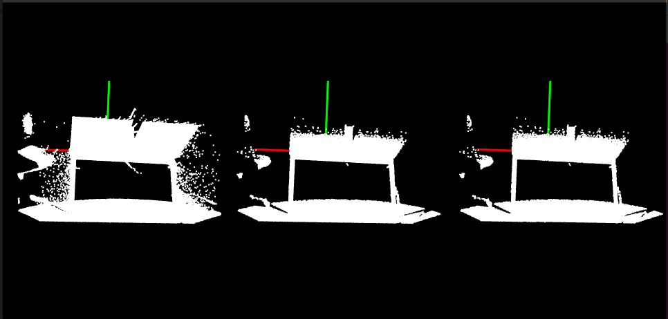
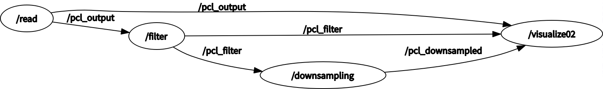

# 第 10 章  点云

本章首先介绍 PCL 库的背景、相关的数据类型，以及 ROS 接口消息，然后展示一些关于如何使用 PCL 库处理数据以及如何通过 ROS 发送和接收数据的技术。

注：本章代码的测试放在当前目录下 `ROS功能包` 中。

## 10.0 安装 PCL

### 安装

```bash
sudo apt update
sudo apt install libpcl-dev
sudo apt install pcl-tools
```

### 测试

```bash
virtual-machine:~$ pcl_v		#(按两下 Tab键)
pcl_vfh_estimation                   pcl_voxel_grid_occlusion_estimation
pcl_viewer                           pcl_vtk2obj
pcl_virtual_scanner                  pcl_vtk2pcd
pcl_vlp_viewer                       pcl_vtk2ply
pcl_voxel_grid 
```

若能够弹出以上信息，则说明 PCL 安装成功。

### 显示点云

```bash
pcl_viewer xxx.pcd
```

## 10.1 理解点云库

下面是点云中最重要的公共字段。

- header：这个字段是 pcl::PCLHeader 类型，指定了点云的获取时间。
- points：这个字段是 std::vector<PointT, ...>类型，它是存储所有点的容器。vector 定义中的 PointT 对应于类的模板参数，即点的类型。
- width：这个字段指定了点云组织成一种图像时的宽度，否则它包含的是云中点的数量。
- height：这个字段指定了点云组织成一种图像时的高度，否则它总是1。
- is_dense：这个字段指定了点云中是否有无效值(无穷大或NaN值)。
- sensor_origin\_：这个字段是 Eigen:Vector4f 类型，并且定义了传感器根据相对于原点的平移所得到的位姿。
- sensor_orientation_ ：这个字段是 Eigen::Quaternionf 类型，并且定义了传感器旋转所得到的位姿。


### 10.1.1 不同的点云类型

PCL 定义了许多不同类型的点，下面是一些最常用到的类型：

- pcl:PointXYZ：这是最简单也可能是最常用到的点类型;它只存储了 3D xyz 的信息。
- pcl:PointXYZl：这种类型非常类似于上面的那种，但它还包含了一个描述点亮度 (intensity) 的字段。当想要获取传感器返回的亮度高于一定级别的点时，它非常有用。还有与此相似的其他两种标准的点数据类型：一是pcl::InterestPoint，它有一个字段存储强度(strength)；二是 pcl::PointWithRange，它有一个字段用来存储距离(视点到采样点)，而不是亮度或强度。
- pcl::PointXYZRGBA：这种点类型存储 3D 信息，也存储颜色 ( RGB=Red, Green, Blue）和透明度 (A=Alpha)。
- pcl::PointXYZRGB：这种点类型与前面的点类型相似，但是它没有透明度字段。
- pcl::Normal：这是最常用的点类型，表示曲面上给定点处的法线以及测量的曲率。
- pcl::PointNormal：这种点类型跟前一个点类型一样，它包含了给定点所在曲面法线以及曲率信息，但是它也包含了点的 3D XYZ 坐标。这种点类型的变异类型是 PointXYZRGB-Normal 和 PointXYZINormal，顾名思义，它们包含了颜色(前者）和亮度(后者)。


### 10.1.2 PCL中的算法

高效的数据结构和算法。


### 10.1.3 ROS的PCL接口

通过 ROS 自带的基于消息的通信系统，ROS 的 PCL 接口提供了与 PCL 数据结构进行通信所需要的方法。为此，这里定义了不同的消息类型去处理点云和其他 PCL 算法中产生的数据。结合这些消息类型，也提供了一组将本地PCL 数据类型转换为消息的函数。

其中一些最重要的消息类型如下所示：

- std_msgs::Header：这不是真的消息类型，但它通常是每一个 ROS 消息的一部分。它包含消息发送时间、序列号和坐标系名称等信息。这个 PCL 类型等价于 pcl::Header type。
- **sensor_msgs::PointCloud2**：这也许是最重要的消息类型。这个消息用来传递 pcl::PointCloud 类型。然而，必须考虑的是，在未来支持 pcl::PCLPointCloud2 的 PCL 版本中这个消息类型将会弃用。
- pcl_msgs::PointIndices：这个消息类型存储了一个点云中点的索引，等价的 PCL 类型是 pcl:PointIndices。
- pcl_msgs::PolygonMesh：这个消息类型保存了描绘网格(即顶点和多边形)的信息，等价的 PCL 类型是pcl::PolygonMesh。
- pcl_msgs::Vertices：这个消息类型将一组顶点的索引保存在一个数组中，例如，用于描述一个多边形。等价的 PCL 类型是 pcl::Vertices。
- pcl_msgs::ModelCoefficients：这个消息类型存储了一个模型的不同系数，例如描述一个平面需要的 4 个参数。等价的 PCL 类型是 pcl::ModelCoefficients。

通过 ROS 的 PCL 功能包提供的转换函数可以将前面的消息转换为 PCL 类型或者从 PCL 类型转换为消息。所有这些函数都有一个相似签名 ( signature)，这意味着一旦我们知道如何转换一个类型，就知道如何转换所有的类型了。下面的函数是由 pcl_conversions 命名空间提供的:

```cpp
void fromPCL(const <PCL Type> &, <ROS Message type> &);
void moveFromPCL(<PCL Type> &, <ROS Message type> &);
void toPCL(const <ROS Message type> &, <PCL Type> &);
void moveToPCL(<ROS Message type> &, <PCL Type>&);
```

这里，PCL Type 必须用一个预先指定的 PCL 类型替代，ROS Message type 必须用消息类型替代。sensor_msgs::PointCloud2 指定了—组函数执行这些转换:（下面的函数内部其实调用了上面的函数）

```cpp
void toROSMsg(const pcl::PointCloud<T>&, sensor_msgs::PointCloud2&);
void fromROSMsg(const sensor_msgs::PointCloud2&, pcl::PointCloud<T>&);
void moveFromRoSMsg(sensor_msgs::PointCloud2 &, pcl::Pointcloud<T>&);
```

你也许会好奇每个函数和它的 move 版本之间的区别。答案很简单，标准版本执行对数据的深复制，而 move 版本执行浅复制并注销源数据容器。这称为移动语义( move semantics) 。


## 10.2 我的第一个PCL程序

新建一个功能包，该功能包依赖如下：

```bash
catkin_create_pkg 包名 roscpp rospy std_msgs pcl_conversions pcl_ros pcl_msgs sensor_msgs
```

修改 CmakeLists.txt 文件：

```cmake
find_package(PCL REQUIRED)	#(添加)

include_directories(
  include
  ${catkin_INCLUDE_DIRS}
  ${PCL_INCLUDE_DIRS}		#(添加)
)
```

### 10.2.1 创建点云

在下面第一个示例中，读者将会学习如何创建仅由伪随机点组成的 PCL 点云。这个 PCL 点云最终会通过一个称为 /pcl_output 的主题定期发布出去。下面的示例展示了为将点云广播到订阅者，如何产生带有定制数据的点云以及如何将它们转换为相应的 ROS 消息类型。

**代码：**

```cpp
#include <ros/ros.h>
#include <pcl/point_cloud.h>
#include <pcl_conversions/pcl_conversions.h>
#include <sensor_msgs/PointCloud2.h>

int main (int argc, char *argv[])
{
    ros::init (argc, argv, "pcl_create");

    ros::NodeHandle nh;
    ros::Publisher pcl_pub = nh.advertise<sensor_msgs::PointCloud2> ("pcl_output", 1);
    pcl::PointCloud<pcl::PointXYZ> cloud;
    sensor_msgs::PointCloud2 output;

    // Fill in the cloud data
    cloud.width  = 100;
    cloud.height = 1;
    cloud.points.resize(cloud.width * cloud.height);

    for (size_t i = 0; i < cloud.points.size (); ++i)
    {
        cloud.points[i].x = 1024 * rand () / (RAND_MAX + 1.0f);
        cloud.points[i].y = 1024 * rand () / (RAND_MAX + 1.0f);
        cloud.points[i].z = 1024 * rand () / (RAND_MAX + 1.0f);
    }

    //Convert the cloud to ROS message
    pcl::toROSMsg(cloud, output);
    // 设置frame_id字段,为了能够在 RViz 可视化程序中可视化PointCloud2消息
    output.header.frame_id = "odom";


    ros::Rate loop_rate(1);
    while (ros::ok())
    {
        pcl_pub.publish(output);
        ros::spinOnce();
        loop_rate.sleep();
    }

    return 0;
}
```

**修改 CmakeLists.txt 文件：**

```cmake
add_executable(pcl_create src/pcl_create.cpp)

target_link_libraries(pcl_create 
	${catkin_LIBRARIES} 
	${PCL_LIBRARIES}		# (添加)
)
```

**启动节点**

```bash
roscore						# 启动 roscore

catkin_make					# 编译
source ./devel/setup.bash	# 更新配置文件
rosrun pkg pcl_create
```

**在 rviz 中显示**

```bash
rviz		# 开启 rviz
```

为能显示出点云，在打开 rviz 界面后，做如下修改：

1. 将上方 Fixed Frame 由 map 修改为 odom（这是自己设置的，output.header.frame_id = "odom";）
2. 点击 Add 添加 PointCloud2 类型，点击 PointCloud2 打开后，在 Topic 一栏中，选择 /pcl_output（话题，自己设置的）。

这样点云就在 rviz 中显示了。

### 10.2.2 加载和保存点云到硬盘中

**加载点云**

```cpp
#include "ros/ros.h"
#include "pcl/point_cloud.h"
#include "pcl_conversions/pcl_conversions.h"
#include "sensor_msgs/PointCloud2.h"
#include "pcl/io/pcd_io.h"

int main(int argc, char* argv[]) {
    ros::init(argc, argv, "pcl_read");
    ros::NodeHandle nh;
    ros::Publisher pcl_pub = nh.advertise<sensor_msgs::PointCloud2>("pcl_output", 1);

    sensor_msgs::PointCloud2 output;
    pcl::PointCloud<pcl::PointXYZ>::Ptr cloud(new pcl::PointCloud<pcl::PointXYZ>);
    pcl::io::loadPCDFile("/home/tong/文档/ROS-2022.4/FileSystem/src/ros_pcl/data/test_pcd.pcd", *cloud);	// 问题，设置相对路径不行

    pcl::toROSMsg(*cloud, output);
    output.header.frame_id = "odom";

    ros::Rate loop_rate(1);
    while (ros::ok())
    {
        pcl_pub.publish(output);
        ros::spinOnce();
        loop_rate.sleep();
    }
    
    return 0;
}
```

**保存点云**

```cpp
#include "ros/ros.h"
#include <pcl/point_cloud.h>
#include "pcl_conversions/pcl_conversions.h"
#include "sensor_msgs/PointCloud2.h"
#include <pcl/io/pcd_io.h>

void cloudCB(const sensor_msgs::PointCloud2::ConstPtr &input)
{
    pcl::PointCloud<pcl::PointXYZ>::Ptr cloud(new pcl::PointCloud<pcl::PointXYZ>);
    pcl::fromROSMsg(*input, *cloud);
    pcl::io::savePCDFileASCII("/home/tong/文档/ROS-2022.4/FileSystem/src/ros_pcl/data/write.pcd", *cloud);
}

int main(int argc,  char* argv[])
{
    ros::init(argc, argv, "pcl_write");

    ros::NodeHandle nh;
    ros::Subscriber bat_sub = nh.subscribe<sensor_msgs::PointCloud2>("pcl_output", 10, cloudCB);

    ros::spin();

    return 0;
}
```

**修改 CmakeLists.txt 文件：**

```cmake
add_executable(02_pcl_read src/02_pcl_read.cpp)
add_executable(03_pcl_write src/03_pcl_write.cpp)

target_link_libraries(02_pcl_read 
	${catkin_LIBRARIES} 
	${PCL_LIBRARIES}		# (添加)
)
target_link_libraries(03_pcl_write 
	${catkin_LIBRARIES} 
	${PCL_LIBRARIES}		# (添加)
)
```

**添加 launch 文件：**

```xml
<launch>
    <node pkg = "ros_pcl" type = "02_pcl_read" name = "read" />
    <node pkg = "ros_pcl" type = "03_pcl_write" name = "write" />
</launch>
```

**启动**

```bash
roslaunch ros_pcl startup.launch
```


### 10.2.3 可视化点云

点云可视化在 PCL 中有两个类，分别为 CloudViewer 和 Visualizer，本节以 CloudViewer 为例，Visualization 放到下一小节。

代码：

```cpp
#include <iostream>
#include "ros/ros.h"
#include <pcl/visualization/cloud_viewer.h>
#include <sensor_msgs/PointCloud2.h>
#include <pcl_conversions/pcl_conversions.h>

class cloudHandler {
public:
    cloudHandler(): viewer("Cloud Viewer")
    {
        pcl_sub = nh.subscribe("pcl_output", 10, &cloudHandler::cloudCB, this);
        viewer_timer = nh.createTimer(ros::Duration(0, 1), &cloudHandler::timerCB, this);	// 设置定时器，每 100ms 触发一次回调检查窗口是否关闭
    }

    void cloudCB(const sensor_msgs::PointCloud2::ConstPtr input)
    {
        pcl::PointCloud<pcl::PointXYZ>::Ptr cloud(new pcl::PointCloud<pcl::PointXYZ>);
        pcl::fromROSMsg(*input, *cloud);
        viewer.showCloud(cloud);
    }

    void timerCB(const ros::TimerEvent&)
    {
        if (viewer.wasStopped())	// 窗口是否关闭，已经关闭则终止代码的执行
        {
            ros::shutdown();
        }
    }

private:
    ros::NodeHandle nh;
    ros::Subscriber pcl_sub;
    pcl::visualization::CloudViewer viewer;
    ros::Timer viewer_timer;
};

int main(int argc, char* argv[])
{
    ros::init(argc, argv, "pcl_visualize");

    cloudHandler handler;

    ros::spin();

    return 0;
}
```

与之前的 pcl_read 搭配使用：

修改CMakeLists.tx

launch 文件：

```xml
<launch>
    <!-- 04 visualize point cloud -->
    <node pkg = "ros_pcl" type = "02_pcl_read" name = "read" />
    <node pkg = "ros_pcl" type = "04_pcl_visualize" name = "cloudviewer" />
</launch>
```

运行。


### 10.2.4 滤波和缩减采样

**流程：读入-->滤波-->降采样-->显示**

**滤波**

```cpp
#include "ros/ros.h"
#include <pcl/point_cloud.h>
#include <pcl_conversions/pcl_conversions.h>
#include <sensor_msgs/PointCloud2.h>
#include <pcl/filters/statistical_outlier_removal.h>

class cloudHandler {
public:
    cloudHandler() {
        pcl_sub = nh.subscribe("pcl_output", 10, &cloudHandler::cloudCB, this);
        pcl_pub = nh.advertise<sensor_msgs::PointCloud2>("pcl_filter", 1);
    }

    void cloudCB(const sensor_msgs::PointCloud2::ConstPtr input)
    {
        pcl::PointCloud<pcl::PointXYZ>::Ptr cloud(new pcl::PointCloud<pcl::PointXYZ>);
        pcl::PointCloud<pcl::PointXYZ>::Ptr cloud_filtered(new pcl::PointCloud<pcl::PointXYZ>);
        sensor_msgs::PointCloud2 output;

        pcl::fromROSMsg(*input, *cloud);

        pcl::StatisticalOutlierRemoval<pcl::PointXYZ> statFilter;
        statFilter.setInputCloud(cloud);
        statFilter.setMeanK(10);
        statFilter.setStddevMulThresh(0.2);
        statFilter.filter(*cloud_filtered);

        pcl::toROSMsg(*cloud_filtered, output);
        pcl_pub.publish(output);
    }

private:
    ros::NodeHandle nh;
    ros::Subscriber pcl_sub;
    ros::Publisher pcl_pub;
};

int main(int argc, char* argv[])
{
    ros::init(argc, argv, "pcl_filter");

    cloudHandler handler;

    ros::spin();

    return 0;
}

```

**降采样**

```cpp
#include <ros/ros.h>
#include <pcl/point_cloud.h>
#include <pcl_conversions/pcl_conversions.h>
#include <sensor_msgs/PointCloud2.h>
#include <pcl/filters/voxel_grid.h>

class cloudHandler {
public:
    cloudHandler() {
        pcl_sub = nh.subscribe("pcl_filter", 10, &cloudHandler::cloudCB, this);
        pcl_pub = nh.advertise<sensor_msgs::PointCloud2>("pcl_downsampled", 1);
    }

    void cloudCB(const sensor_msgs::PointCloud2::ConstPtr input)
    {
        pcl::PointCloud<pcl::PointXYZ>::Ptr cloud(new pcl::PointCloud<pcl::PointXYZ>);
        pcl::PointCloud<pcl::PointXYZ>::Ptr cloud_downsampled(new pcl::PointCloud<pcl::PointXYZ>);
        sensor_msgs::PointCloud2::Ptr output(new sensor_msgs::PointCloud2);

        pcl::fromROSMsg(*input, *cloud);

        pcl::VoxelGrid<pcl::PointXYZ> voxelSampler;
        voxelSampler.setInputCloud(cloud);
        voxelSampler.setLeafSize(0.01f, 0.01f, 0.01f);
        voxelSampler.filter(*cloud_downsampled);

        pcl::toROSMsg(*cloud_downsampled, *output);
        pcl_pub.publish(*output);
    }

private:
    ros::NodeHandle nh;
    ros::Subscriber pcl_sub;
    ros::Publisher pcl_pub;
};

int main(int argc, char* argv[]) {
    ros::init(argc, argv, "pcl_downsampling");

    cloudHandler handler;

    ros::spin();

    return 0;
}
```

**显示**

```cpp
#include "ros/ros.h"
#include <pcl/point_cloud.h>
#include <pcl_conversions/pcl_conversions.h>
#include <sensor_msgs/PointCloud2.h>
#include <pcl/visualization/pcl_visualizer.h>

class cloudHandler
{  
public:
    cloudHandler() {
        output_sub = nh.subscribe("pcl_output", 1, &cloudHandler::outputCB, this);
        filtered_sub = nh.subscribe("pcl_filter", 1, &cloudHandler::filteredCB, this);
        downsampled_sub = nh.subscribe("pcl_downsampled", 1, &cloudHandler::downsampledCB, this);
        viewer_timer = nh.createTimer(ros::Duration(0.1), &cloudHandler::timerCB, this);

        viewer.createViewPort(0.0, 0.0,0.33, 1.0, output_view);
        viewer.setBackgroundColor(0, 0, 0, output_view);

        viewer.createViewPort(0.33, 0.0,0.66, 1.0, filtered_view);
        viewer.setBackgroundColor(0, 0, 0, filtered_view);

        viewer.createViewPort(0.66, 0.0,1.0, 1.0, downsampled_view);
        viewer.setBackgroundColor(0, 0, 0, downsampled_view);

        viewer.addCoordinateSystem(1.0);
        viewer.initCameraParameters();
    }

    void outputCB(const sensor_msgs::PointCloud2::ConstPtr input)
    {
        pcl::PointCloud<pcl::PointXYZ>::Ptr cloud(new pcl::PointCloud<pcl::PointXYZ>);
        pcl::fromROSMsg(*input, *cloud);

        viewer.removeAllPointClouds(output_view);
        viewer.addPointCloud<pcl::PointXYZ>(cloud, "output", output_view);
    }

    void filteredCB(const sensor_msgs::PointCloud2::ConstPtr input)
    {
        pcl::PointCloud<pcl::PointXYZ>::Ptr cloud(new pcl::PointCloud<pcl::PointXYZ>);
        pcl::fromROSMsg(*input, *cloud);

        viewer.removeAllPointClouds(filtered_view);
        viewer.addPointCloud<pcl::PointXYZ>(cloud, "filtered", filtered_view);
    }

    void downsampledCB(const sensor_msgs::PointCloud2::ConstPtr input)
    {
        pcl::PointCloud<pcl::PointXYZ>::Ptr cloud(new pcl::PointCloud<pcl::PointXYZ>);
        pcl::fromROSMsg(*input, *cloud);

        viewer.removeAllPointClouds(downsampled_view);
        viewer.addPointCloud<pcl::PointXYZ>(cloud, "downsampled", downsampled_view);
    }

    void timerCB(const ros::TimerEvent&)
    {
        viewer.spinOnce();
        if (viewer.wasStopped())
        {
            ros::shutdown();
        }
    }

private:    
    ros::NodeHandle nh;
    ros::Subscriber output_sub, filtered_sub, downsampled_sub;
    pcl::visualization::PCLVisualizer viewer;
    int output_view, filtered_view, downsampled_view;
    ros::Timer viewer_timer;
};

int main(int argc, char* argv[])
{
    ros::init(argc, argv, "pcl_visualize2");

    cloudHandler handler;

    ros::spin();

    return 0;
}
```

配置 CMakeLists.txt，修改 launch 文件：

```xml
<launch>
    <!-- 05 read filter downsample visualize pointcloud -->
    <node pkg = "ros_pcl" type = "02_pcl_read" name = "read" />
    <node pkg = "ros_pcl" type = "05_pcl_filter" name = "filter" />
    <node pkg = "ros_pcl" type = "06_pcl_downsampling" name = "downsampling" />
    <node pkg = "ros_pcl" type = "04_pcl_visualize02" name = "visualize02" />

</launch>
```

启动 launch 文件。

显示结果如下：



话题连接如下：




### 10.2.5 配准与匹配

代码：使用的降采样后的数据，待配准点云为目标点云移动后的点云。

```cpp
#include <ros/ros.h>
#include <pcl/point_cloud.h>
#include <pcl_conversions/pcl_conversions.h>
#include <sensor_msgs/PointCloud2.h>
#include <pcl/registration/icp.h>

class cloudHandler {
public:
    cloudHandler() {
        pcl_sub = nh.subscribe("pcl_downsampled", 10, &cloudHandler::clouCB, this);
        pcl_pub = nh.advertise<sensor_msgs::PointCloud2>("pcl_matched", 1);
    }

    void clouCB(const sensor_msgs::PointCloud2::ConstPtr input)
    {
        pcl::PointCloud<pcl::PointXYZ>::Ptr cloud_in(new pcl::PointCloud<pcl::PointXYZ>);
        pcl::PointCloud<pcl::PointXYZ>::Ptr cloud_out(new pcl::PointCloud<pcl::PointXYZ>);
        pcl::PointCloud<pcl::PointXYZ>::Ptr cloud_aligned(new pcl::PointCloud<pcl::PointXYZ>);
        sensor_msgs::PointCloud2::Ptr output(new sensor_msgs::PointCloud2);

        pcl::fromROSMsg(*input, *cloud_in);

        *cloud_out = *cloud_in;

        for (size_t i = 0; i < cloud_in->size(); ++i)
        {
            cloud_in->at(i).x = cloud_in->at(i).x + 0.7f;
        }

        pcl::IterativeClosestPoint<pcl::PointXYZ, pcl::PointXYZ> icp;
        icp.setInputSource(cloud_out);
        icp.setInputTarget(cloud_in);

        icp.setMaxCorrespondenceDistance(5);
        icp.setMaximumIterations(100);
        icp.setTransformationEpsilon(1e-12);
        icp.setEuclideanFitnessEpsilon(0.1);

        icp.align(*cloud_aligned);

        pcl::toROSMsg(*cloud_aligned, *output);
        output->header.frame_id = "odom";
        pcl_pub.publish(*output);
    }

private:
    ros::NodeHandle nh;
    ros::Subscriber pcl_sub;
    ros::Publisher pcl_pub;
};

int main(int argc, char *argv[])
{
    ros::init(argc, argv, "pcl_matching");

    cloudHandler handler;

    ros::spin();

    return 0;
}
```


### 10.2.6 点云分区

使用八叉树查找最近邻。

```cpp
#include <ros/ros.h>
#include <pcl/point_cloud.h>
#include <pcl_conversions/pcl_conversions.h>
#include <sensor_msgs/PointCloud2.h>
#include <pcl/octree/octree.h>

class cloudHandler
{
public:
    cloudHandler()
    {
        pcl_sub = nh.subscribe("pcl_downsampled", 10, &cloudHandler::cloudCB, this);
        pcl_pub = nh.advertise<sensor_msgs::PointCloud2>("pcl_partitioned", 1);
    }

    void cloudCB(const sensor_msgs::PointCloud2 &input)
    {
        pcl::PointCloud<pcl::PointXYZ> cloud;
        pcl::PointCloud<pcl::PointXYZ> cloud_partitioned;
        sensor_msgs::PointCloud2 output;

        pcl::fromROSMsg(input, cloud);

        float resolution = 128.0f;
        pcl::octree::OctreePointCloudSearch<pcl::PointXYZ> octree (resolution);

        octree.setInputCloud (cloud.makeShared());
        octree.addPointsFromInputCloud ();

        pcl::PointXYZ center_point;
        center_point.x = 0 ;
        center_point.y = 0.4;
        center_point.z = -1.4;

        float radius = 0.5;
        std::vector<int> radiusIdx;
        std::vector<float> radiusSQDist;
        if (octree.radiusSearch (center_point, radius, radiusIdx, radiusSQDist) > 0)
        {
            for (size_t i = 0; i < radiusIdx.size (); ++i)
            {
                cloud_partitioned.points.push_back(cloud.points[radiusIdx[i]]);
            }
        }

        pcl::toROSMsg(cloud_partitioned, output);
        output.header.frame_id = "odom";
        pcl_pub.publish(output);
    }

protected:
    ros::NodeHandle nh;
    ros::Subscriber pcl_sub;
    ros::Publisher pcl_pub;
};

int main(int argc, char **argv)
{
    ros::init(argc, argv, "pcl_partitioning");

    cloudHandler handler;

    ros::spin();

    return 0;
}

```


## 10.3 分割

**利用 RANSAC 进行平面拟合：**

**方式一：**

```cpp
#include <ros/ros.h>
#include <pcl/point_cloud.h>
#include <pcl/sample_consensus/ransac.h>
#include <pcl/sample_consensus/sac_model_plane.h>
#include <pcl_conversions/pcl_conversions.h>
#include <sensor_msgs/PointCloud2.h>

class cloudHandler {
public:
    cloudHandler() {
        pcl_sub = nh.subscribe("pcl_downsampled", 10, &cloudHandler::cloudCB, this);
        pcl_pub = nh.advertise<sensor_msgs::PointCloud2>("pcl_plane", 1);
    }

    void cloudCB(const sensor_msgs::PointCloud2& input)
    {
        pcl::PointCloud<pcl::PointXYZ>::Ptr cloud(new pcl::PointCloud<pcl::PointXYZ>);
        pcl::PointCloud<pcl::PointXYZ>::Ptr final(new pcl::PointCloud<pcl::PointXYZ>);
        sensor_msgs::PointCloud2::Ptr output(new sensor_msgs::PointCloud2);

        pcl::fromROSMsg(input, *cloud);

        cloud->width = 500;
        cloud->height = 1;
        cloud->is_dense = false;
        cloud->resize(cloud->width * cloud->height);

        std::vector<int> inliers;

        pcl::SampleConsensusModelPlane<pcl::PointXYZ>::Ptr model_p(new pcl::SampleConsensusModelPlane<pcl::PointXYZ>(cloud));

        pcl::RandomSampleConsensus<pcl::PointXYZ> ransac(model_p);
        ransac.setDistanceThreshold(0.1);
        ransac.computeModel();
        ransac.getInliers(inliers);

        pcl::copyPointCloud<pcl::PointXYZ>(*cloud, inliers, *final);
        pcl::toROSMsg(*final, *output);
        pcl_pub.publish(output);
    }

private:
    ros::NodeHandle nh;
    ros::Subscriber pcl_sub;
    ros::Publisher pcl_pub;
};

int main(int argc, char* argv[])
{
    ros::init(argc, argv, "pcl_model_estimation");

    cloudHandler handler;

    ros::spin();

    return 0;
}
```

**方式二：同时发布 pcl_msgs::PointIndices、pcl_msgs::ModelCoefficients 消息**

```cpp
#include <ros/ros.h>
#include <pcl/point_cloud.h>
#include <pcl_conversions/pcl_conversions.h>
#include <pcl/ModelCoefficients.h>
#include <pcl/sample_consensus/method_types.h>
#include <pcl/sample_consensus/model_types.h>
#include <pcl/segmentation/sac_segmentation.h>
#include <pcl/filters/extract_indices.h>
#include <sensor_msgs/PointCloud2.h>

class cloudHandler
{
public:
    cloudHandler()
    {
        pcl_sub = nh.subscribe("pcl_downsampled", 10, &cloudHandler::cloudCB, this);
        pcl_pub = nh.advertise<sensor_msgs::PointCloud2>("pcl_segmented", 1);
        ind_pub = nh.advertise<pcl_msgs::PointIndices>("point_indices", 1);
        coef_pub = nh.advertise<pcl_msgs::ModelCoefficients>("planar_coef", 1);
    }

    void cloudCB(const sensor_msgs::PointCloud2 &input)
    {
        pcl::PointCloud<pcl::PointXYZ> cloud;
        pcl::PointCloud<pcl::PointXYZ> cloud_segmented;

        pcl::fromROSMsg(input, cloud);

        pcl::ModelCoefficients coefficients;
        pcl::PointIndices::Ptr inliers(new pcl::PointIndices());

        // Create the segmentation object
        pcl::SACSegmentation<pcl::PointXYZ> segmentation;
        segmentation.setModelType(pcl::SACMODEL_PLANE);
        segmentation.setMethodType(pcl::SAC_RANSAC);
        segmentation.setMaxIterations(1000);
        segmentation.setDistanceThreshold(0.01);
        segmentation.setInputCloud(cloud.makeShared());
        segmentation.segment(*inliers, coefficients);

        // Publish the model coefficients
        pcl_msgs::ModelCoefficients ros_coefficients;
        pcl_conversions::fromPCL(coefficients, ros_coefficients);
        coef_pub.publish(ros_coefficients);

        // Publish the Point Indices
        pcl_msgs::PointIndices ros_inliers;
        pcl_conversions::fromPCL(*inliers, ros_inliers);
        ind_pub.publish(ros_inliers);

        // Create the filtering object
        pcl::ExtractIndices<pcl::PointXYZ> extract;
        extract.setInputCloud(cloud.makeShared());
        extract.setIndices(inliers);
        extract.setNegative(false);
        extract.filter(cloud_segmented);

        //Publish the new cloud
        sensor_msgs::PointCloud2 output;
        pcl::toROSMsg(cloud_segmented, output);
        pcl_pub.publish(output);
    }

protected:
    ros::NodeHandle nh;
    ros::Subscriber pcl_sub;
    ros::Publisher pcl_pub, ind_pub, coef_pub;
};

int main(int argc, char **argv)
{
    ros::init(argc, argv, "pcl_planar_segmentation");

    cloudHandler handler;

    ros::spin();

    return 0;
}
```


## 10.4 本章小结

本章探讨了 PCL 中各种不同的工具、算法和用来与 ROS 中的点云进行交互的接口，展现了如何将 PCL 库的基本功能与 ROS 集成。