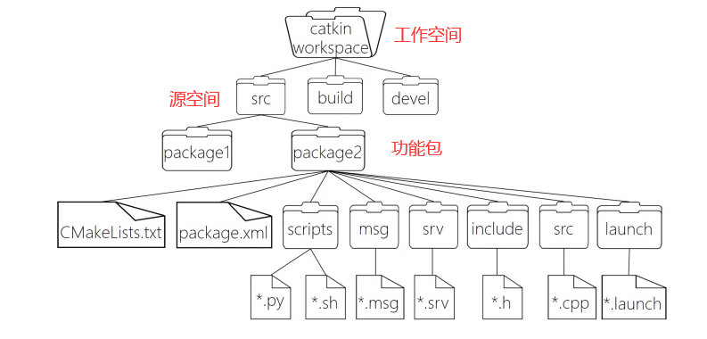
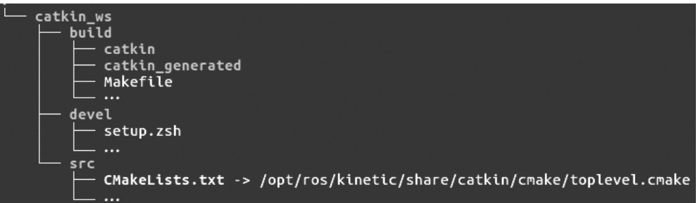

# ROS 文件系统

## 概览



```
WorkSpace --- 自定义的工作空间

    |--- build:编译空间，用于存放CMake和catkin的缓存信息、配置信息和其他中间文件。

    |--- devel:开发空间，用于存放编译后生成的目标文件，包括头文件、动态&静态链接库、可执行文件等。

    |--- src: 源空间

        |-- package：功能包(ROS基本单元)包含多个节点、库与配置文件，包名所有字母小写，只能由字母、数字与下划线组成

            |-- CMakeLists.txt 配置编译规则，比如源文件、依赖项、目标文件

            |-- package.xml 包信息，比如:包名、版本、作者、依赖项...(以前版本是 manifest.xml)

            |-- scripts 存储python文件

            |-- src 存储C++源文件

            |-- include 头文件

            |-- msg 消息通信格式文件

            |-- srv 服务通信格式文件

            |-- action 动作格式文件

            |-- launch 可一次性运行多个节点 

            |-- config 配置信息

        |-- CMakeLists.txt: 编译的基本配置
```


## 工作空间



- **src** 源文件空间(Source space) :在源空间( src文件夹)中，放置了功能包、项目、复制的包等。在这个空间中，最重要的一个文件是CMakeLists.txt。当在工作空间中配置包时, src文件夹中有CMakeLists.txt因为cmake调用它。这个文件是通过catkin_init_workspace命令创建的。
- **build** 编译空间(build space) :在build文件夹里，cmake和catkin为功能包和项目保存缓存信息、配置和其他中间文件。
- **devel** 开发空间 ( Development (devel) space) :devel文件夹用来保存编译后的程序，这些是无须安装就能用来测试的程序。一旦项目通过测试，就可以安装或导出功能包从而与其他开发人员分享。

**在工作空间中进行编译：**

```bash
catkin_make
```


## 源空间

源空间内可以创建多个功能包，源空间包含内容如下：

```
workspace_folder/        -- WORKSPACE 工作空间
  src/                   -- SOURCE SPACE 源空间
    CMakeLists.txt       -- 'Toplevel' CMake file, provided by catkin
    package_1/
      CMakeLists.txt     -- CMakeLists.txt file for package_1
      package.xml        -- Package manifest for package_1
    ...
    package_n/
      CMakeLists.txt     -- CMakeLists.txt file for package_n
      package.xml        -- Package manifest for package_n
```

**在源空间创建功能包：**

```cpp
catkin_create_pkg 自定义ROS包名 roscpp rospy std_msgs
```


## 功能包

功能包包含如下内容：

- include/package_name/: 此目录包含了需要的库的头文件。
- msg/∶如果开发需要非标准的消息，请把文件放在这里。
- scripts/:其中包括Bash、Python或任何其他脚本语言的可执行脚本。
- src/:这是存储程序源文件的地方。你可能会为节点创建一个文件夹或按照希望的方式组织它。
- srv/:这表示服务(srv)类型。
- CMakeLists.txt:这是CMake的生成文件。
- package.xml:这是功能包清单文件。

文件package.xml必须在每个功能包中，它用来说明此包相关的各类信息。如果你发现在某个文件夹内包含此文件，那么这个文件夹很可能是一个包或元功能包。打开一个package.xml文件，可以看到包的名称、依赖关系等信息。功能包清单的作用就是为了方便安装和分发这些功能包。

