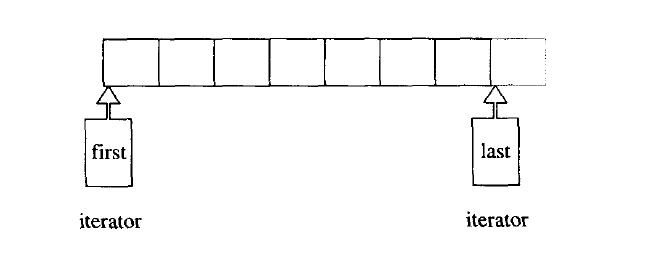

### 1.9.5  前闭后开区间表示法 [ )

**任何一个 STL 算法，都需要获得由一对迭代器（泛型指针）所标示的区间，用以表示操作范围。这一对迭代器所标示的是个所谓的前闭后开区间，以 [first, last) 表示。**也就是说，整个实际范围从 first 开始，直到 last-1。迭代器 last 所指的是 “最后一个元素的下一位置”。这种 off by one（偏移一格，或说 pass the end ) 的标示法，带来了许多方便，例如下面两个 STL 算法的循环设计，就显得干净利落：

```cpp

#include <iostream>
#include <vector>
using namespace std;

namespace sgi {
	template <class InputIterator, class T>
	InputIterator find(InputIterator first, InputIterator last, const T& value) {
		while (first != last && *first != value)
			++first;
		return first;
	}

	template <class InputIterator, class Function>
	Function for_each(InputIterator first, InputIterator last, Function f) {
		for (; first != last; ++first)
			f(*first);
		return f;
	}
}

// 函数对象/仿函数
template <class T>
class print {
public:
	void operator() (const T& t) {
		cout << t << " ";
	}
};

int main() {
	vector<int> ia = { 0, 1, 2, 3, 4 };
	vector<int>::iterator it = sgi::find(ia.begin(), ia.end(), 4);
	if (it != ia.end()) {
		cout << "Found value." << endl;		// Found value.
	}
	else {
		cout << "Not found." << endl;
	}

	sgi::for_each(ia.begin(), ia.end(), print<int>());	// 0 1 2 3 4 

	return 0;
}
```

前闭后开区间图示如下（注意，元素之间无需占用连续内存空间）:

