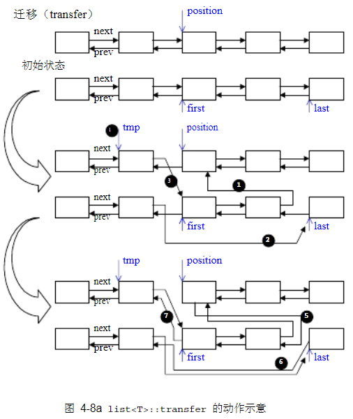

# list 的元素操作

## transfer

list 内部提供一个所谓的迁移操作（transfer）：将某连续范围的元素迁移到某个特定位置之前。技术上很简单，节点间的指针移动而己。这个操作为其它的复杂操作如 splice、sort、merge 等奠定良好的基础。下面是 transfer的源代码: 

```cpp
// 将 [first, last) 内的所有元素移动到 position 之前
void transfer(iterator position, iterator first, iterator last)
{
    if (postion != last)
    {
        (*(link_type((*last.node).prev))).next = positon.node;	// (1)
        (*(link_type((*first.node).prev))).next = last.node;	// (2)
        (*(link_type((*positon.node).prev))).next = first.node;	// (3)
        link_type tmp = link_type((*position.node).prev);		// (4)
        (*position.node).prev = (*last.node).prev;				// (5)
        (*last.node).prev = (*first.node).prev;					// (6)
        (*first.node).prev = tmp;								// (7)
    }
}
```




## splice

```cpp
// 将 x 结合于 position 所指位置之前， x 必须不同于 *this
void splice(iterator position, list& x)
{
    if (!x.empty())
        transfer(position, x.begin(), x.end());
}

// 将 i 所指元素结合于 position 所指位置之前，position 和 i 可指向同一个 list
void splice(iterator position, list&, iterator i)
{
    iterator j = i;
    ++j;
    if (postion == i || postion == j)
        return ;
    transfer(postion, i, j);
}

// 将 [first, last) 内的所有元素结合于 position 所指位置之前
// position 和 [first, last) 可指向同一个 list，但 position 不能位于 [first, last) 之内
void splice(iterator position, list&, iterator first, iterator last)
{
    if (first != last)
    {
        transfer(postion, first, last);
    }
}
```

## merge

```cpp
// merge() 将 x 合并到 *this 身上，两个 this 的内容必须先经过递增排序
template <class T, class Alloc>
void list<T, Alloc>::merge(list<T, Alloc>& x)
{
    iterator fisrt1 = begin();
    iterator last1 = last();
    iterator first2 = x.begin();
    iterator last1 = x.last();
    
    while (first1 != last1 && first2 != last2)
    {
        if (*first2 < * first1)
        {
            iterator next = first2;
            transfer(first1, fisrt2, ++next);
            first2 = next;
        }
        else
            ++first1;
    }
    if (first2 != last2)
        transfer(last1, first2. last2);
}
```

## reverse

```cpp
// reverse() 将 *this 的内容逆向重置
template <class T, class Alloc>
void list<T, Alloc>::reverse()
{
    // 如果是空链表或仅有一个元素，就不进行操作
    if (node->next == node || link_type(node->next)->next == node)
        return ;
    iterator first = begin();
    ++first;
    while (first != end())
    {
        iterator old = first;
        ++fisrt;
        transfer(begin(), old, first);
    }
}
```

## sort

```cpp
// list 不能使用 STL 算法 sort，必须使用自己的 sort member function
// 因为 STL 算法 sort 只接受随机型迭代器
// 本函数采用 quick sort， 时间复杂度 NlogN

template <class T, class Alloc>
void list<T, Alloc>::sort()
{
    // 如果是空链表或仅有一个元素，就不进行操作
    if (node->next == node || link_type(node->next)->next == node)
        return ;
    
    // 一些新的 lists，作为中介数据存放区
    list<T, Alloc> carry;
    list<T, Alloc> counter[64];
    int fill = 0;
    while (!empty())
    {
        carry.splice(carry.begin(), *this, begin());
        int i = 0;
        while (i < fill && !counter[i].empty())
        {
            counter[i].merge(carry);
            carry.swap(counter[i++]);
        }
        carry.swap(counter[i]);
        if (i == fill)
            ++fill;
    }
    for (int i = 1; i < fill; ++i)
        counter[i].merge(counter[i - 1]);
    swap(counter[fill - 1]);
}
```

