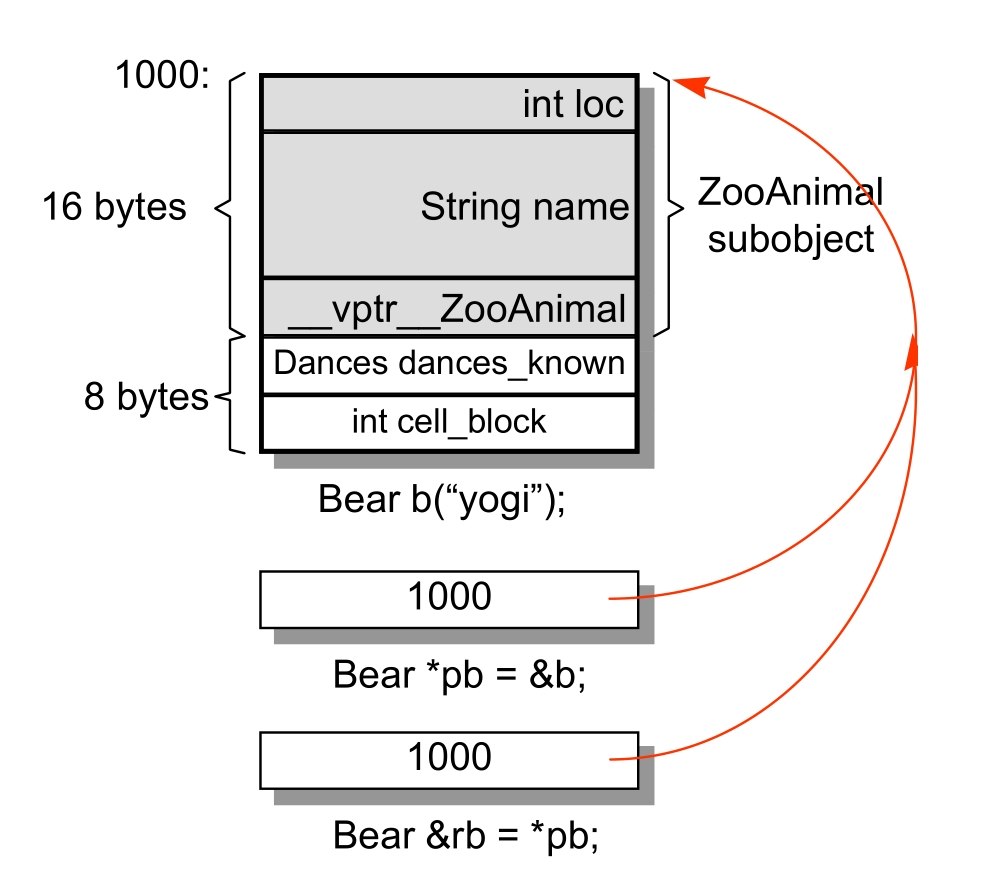

## 第 1 章  关于对象（Object Lessons）

在 C 语言中，“数据” 和 “处理数据的操作（函数)” 是分开来声明的，也就是说，语言本身并没有支持 “数据和函数” 之间的关联性。我们把这种程序方法称为**程序性**的( procedural )，由一组 “分布在各个以功能为导向的函数中” 的算法所驱动，它们处理的是共同的外部数据。

### 1.1  C++对象模式

**在C++，有两种 class data members : static 和 nonstatic，以及三种 class menber functions : static、nonstatic 和 virtual。**

对于 Point 类：

```cpp
class Point {
public:
    Point(float xval);
    virtual ~Point();
    
    float x() const;
    static int PointCount();
    
protected:
    virtual ostream& print(ostream &os) const;
    
    float _x;
    static int _point_count;
};
```

#### C++ 对象模型


**模型简介：**

在此模型中，Nonstatic datamembers 被配置于每一个 class object 之内，static data members 则被存放在所有的 class object 之外。Static 和 nonstatic function members 也被放在所有的 class object 之外。 Virtual functions 则以两个步骤支持之：

1. 每一个 class 产生出一堆指向 virtual functions 的指针，放在表格之中。这个表格被称为 virtual table (vtbl)。
2. 每一个 class object 被添加了一个指针，指向相关的 virtual table。通常这个指针被称为 vptr。vptr 的设定 (setting）和重置（ resetting ）都由每一个 class constructor、destructor 和 copy assignment 运算符自动完成 (在第5章讨论)。每个 class 所关联的 type_info object（用以支持 runtime type identification，RTTI ) 也经由 virtual table 被指出来，通常是放在表格的第一个 slot 处。

**优缺点：**

这个模型的主要优点在于它的**空间和存取时间的效率**;

主要缺点则是，如果应用程序代码本身未曾改变，但所用到的 class objects 的 nonstatic data members 有所修改 (可能是增加、移除或更改），那么那些应用程序代码同样得重新编译。因为它多提供了一层**间接性**，因此付出空间和执行效率两方面的代价。


#### 加上继承（Add Inheritance）

```cpp
class istream : virtual public ios {};
class ostream : virtual public ios {};

class iostream : public istream, public ostream {};
```

一个 derived class 如何在本质上模塑其 base class 的实体呢？在“简单对象模型”中，每一个 base class 可以被derived class object 内的一个 slot 指出，该 slot 内含 base class subobject 的地址。这个体制的主要缺点是，因为间接性而导致空间和存取时间上的额外负担，优点则是 class object 的大小不会因其 base classes 的改变而受到影响。

你也可以想象另一种所谓的 base table 模型。这里所说的 base class table 被产生出来时，表格中的每一个 slot内含一个相关的 base class 地址，这很像 virtual table 内含每一个 virtual function 的地址一样。每一个 class object 内含一个 bptr，它会被初始化，指向其 base class table。这种策略的主要缺点是由于间接性而导致的空间和存取时间上的额外负担，优点则是在每一个 class object 中对于继承都有一致的表现方式：每一个 class object都应该在某个固定位置上安放一个 base table 指针，与 base classes 的大小或数目无关；第二个优点是，不需要改变 class objects 本身，就可以放大、缩小、或更改 base class table。

> base table 模型 相比于 简单对象模型 间接性更强。

**base class table 模型** 


C++ 最初采用的继承模型并不运用任何间接性: base class subobject 的 data members 被直接放置于 derived class object 中。这提供了对 base class members 最紧凑而且最有效率的存取。缺点就是: base class members的任何改变，包括增加、移除或改变类型等等，都使得所有用到 “此 base class 或其 derived class 之 objects” 必须重新编译。

#### 对象模型如何影响程序（How the Object Model Effects Programs）

C++ 对象模型内部对程序是如何操作的，如下面这个例子：

```cpp
X foobar()
{
	X xx;
	X *px = new X;
	
    // foo( )是一个virtual function
    xx.foo();
	px->foo();
    
    delete px;
    return xx;
}
```

这个函数有可能在内部被转化为:

```cpp
// 可能的内部转换结果
// 虚拟 C++ 码
void foobar(X &_result)
{
	// 构造 _result
	// _result用来取代 local xx ...
    _result.X::X();
    
    // 扩展 X *px = new X;
    px = _new(sizeof(X));
    if (px != 0)
        px->X::X();
    
    // 扩展 xx.foo(）但不使用 virtual机制
    // 以 _result 取代 xx
	foo(&_result);
    
    // 使用 virtual 机制扩展 px->foo()
    (*px->vtbl[2])(px)

    // 扩展 delete px;
	if (px != 0) {
		(*px->vtbl[1])(px); // destructor
        _delete(px);
    }

	// 不需使用 named return statement
    // 不需要摧毁 1ocal object xx
	return;
};

```


### 1.2  关键词带来的差异（A Keyword Distinction）

**关键词的困扰**

在 C++ 中 struct 与 class 的差别：

1. 内部访问级别：class 默认 private，struct 默认 public；
2. 默认继承关系：class 默认 private 继承，struct 默认 public 继承。


**策略性正确的 struct （The Politically Correct Struct）**


### 1.3  对象的差异（An Object Distinction）

**面向对象模型**

```cpp
class A
{
public:
    virtual void foo()
    {
        cout << "A" << endl;
    }
};

class B : public A
{
public:
    virtual void foo() override
    {
        cout << "B" << endl;
    }
};

int main()
{
    A a1;
    B b;

    a1 = b;
    a1.foo(); // A

    A &a2 = b;
    a2.foo(); // B

    A *a3 = &b;
    a3->foo(); // B

    return 0;
}
```

虽然你可以直接或间接处理继承体系中的一个 base class object，但只有通过 pointer 或 reference 的间接处理，才支持 OO 程序设计所需的多态性质。

**在 C++，多态只存在于一个个的 public class 体系中。**

**一个 class object 占用多少内存：**

1. 其 nonstatic data members 的总和大小;
2. 加上任何由于 alignment（译注）的需求而填补 ( padding ) 上去的空间 (可能存在于members之间，也可能存在于集合体边界)；
3. 加上为了支持 virtual 而由内部产生的任何额外负担（overhead) 。

```cpp
class A
{
    A() {}			// 0
    int a;			// 4
    char c;			// 1 + 3
    static int s;	// 0
    virtual ~A();	// 8
};

int main()
{
    cout << sizeof(A) << endl;  // 16

    return 0;
}
```


#### 指针的类型（The Type of a Pointer）

一个指向地址 1000 而类型为 void\* 的指针，将涵盖怎样的地址空间呢？是的，我们不知道！这就是为什么一个类型为 void* 的指针只能够含有一个地址，而不能够通过它操作所指之 object 的缘故。

所以，转型（cast）其实是一种编译器指令。大部分情况下它并不改变一个指针所含的真正地址，它只影响 “被指出之内存的大小和其内容” 的解释方式。


#### 加上多态之后（Adding Polymorphism）

```cpp
class Bear : public ZooAnimal {
public :
	Bear();
	~Bear();	// ...
	void rotate();
	virtual void dance ();	// ...
protected:
	enum Dances{ ... };
	Dances dances_known;
    int cell_block;
};

Bear b("Yogi");
Bear *pb = &b;
Bear &rb = *pb;
```

下图展示了上述代码可能的内存布局：



好，假设我们的 Bear object 放在地址 1000 处，一个 Bear 指针和一个 ZooAnimal 指针有什么不同?

```cpp
Bear b;
zooAnimal *pz = &b;
Bear *pb = &b ;
```

它们每个都指向 Bear object 的第一个 byte。其间的差别是，pb 所涵盖的地址包含整个 Bear object，而 pz 所涵盖的地址只包含 Bear object 中的 ZooAnimal subobject。

除了 ZooAnimal subobject 中出现的 members，你不能够使用 pz 来直接处理 Bear 的任何 members。唯一例外是通过 virtual 机制:

```cpp
// 不合法: cell_block 不是 ZooAnimal 的一个 member,
// 虽然我们知道 pz 目前指向一个 Bear object。
pz->cell_block;

// ok:经过一个显式的 downcast 操作就没有问题!
(static_cast<Bear*>(pz))->cell_block;

// 下面这样更好，但它是一个run-time operation(译注:成本较高)
if( Bear* pb2 = dynamic_cast<Bear*>(pz))
	pb2->cell_block;

// ok:因为cell_block是 Bear的一个member。
pb->cell_block;
```

现在，请看以下这种情况:

```cpp
Bear b;
zooAnimal za = b; //译注:这会引起切割(sliced)

//调用 ZooAnimal::rotate()
za.rotate();
```

为什么 rotate() 所调用的是 ZooAnimal 实例而不是 Bear 实例？此外，如果初始化函数 (译注:应用于上述 assignment 操作发生时）将一个 object 内容完整拷贝到另一个 object 去，为什么 za 的 vptr 不指向 Bear 的 virtual table?
第二个问题的答案是，编译器在 (1) 初始化及 (2) 指定 ( assignment ) 操作（将一个 class object 指定给另一个class object ）之间做出了仲裁。编译器必须确保如果某个 object 含有一个或一个以上的 vptrs，那些 vptrs 的内容不会被 base class object 初始化或改变。

至于第一个问题的答案是：za 并不是(而且也绝不会是)一个 Bear，它是(并且只能是)—个 ZooAnimal。多态所造成的 “一个以上的类型” 的潜在力量，并不能够实际发挥在 “直接存取 objects” 这件事情上。有一个似是而非的观念：**OO 程序设计并不支持对 object 的直接处理**。

举个例子，下面一组定义，其中继承关系：Panda -> Bear  -> ZooAnimal

```cpp
{
	ZooAnimal za;
    ZooAnimal *pza;
	Bear b;
	Panda *pp = new Panda ;
	za =& b;
}
```

其可能的内存布局如图所示。


> 为何可以靠指针或引用实现多态，而普通对象就不可以？
>
> 将 za 或 b 的地址，或 pp 所含的内容（也是个地址)，指定给 pza，显然不是问题。一个 pointer 或一个 reference 之所以支持多态，是因为它们并不引发内存中任何 “与类型有关的内存委托操作 ( type-dependent commitment) "；会受到改变的，只有它们所指向的内存的 “大小和内容解释方式” 而已。
>
> 然而，任何人如果企图改变 object za 的大小，会违反其定义中受契约保护的 “资源需求量”。如果把整个 Bear object 指定给 za，则会溢出它所配置得到的内存。执行结果当然也就不对了。

总而言之，多态是一种威力强大的设计机制，允许你继一个抽象的 public 接口之后，封装相关的类型。需要付出的代价就是额外的间接性——不论是在“内存的获得”或是在“类型的决断”上。C++ 通过 class 的 pointers 和 references 来支持多态，这种程序设计风格就称为 “**面向对象**”。


### 本章小结

本章主要介绍了 C++ 对象模型，包括布局、调用时的内部展开，还介绍了多态的原理，为何可以靠指针或引用实现多态，而普通对象就不可以。

本章内容丰富，内容质量较高，非常值得学习！！！