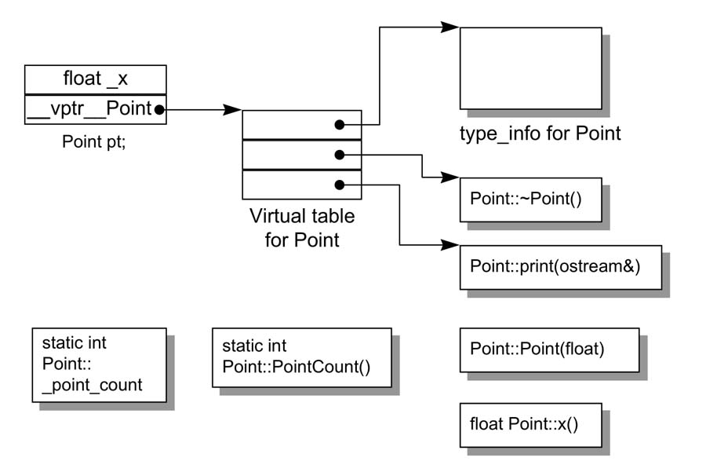
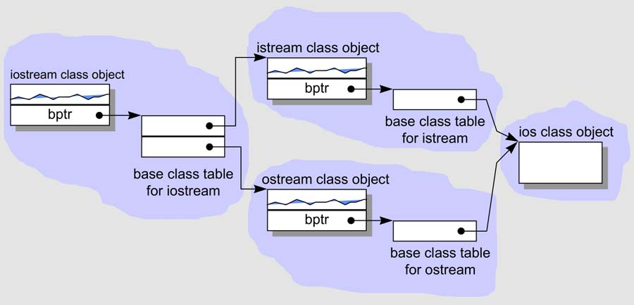
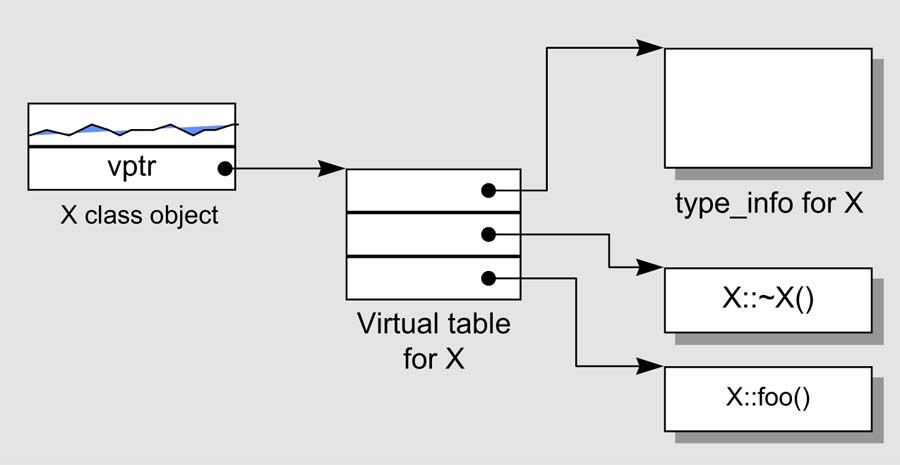

## 第 1 章  关于对象（Object Lessons）

在 C 语言中，“数据” 和 “处理数据的操作（函数)” 是分开来声明的，也就是说，语言本身并没有支持 “数据和函数” 之间的关联性。我们把这种程序方法称为**程序性**的( procedural )，由一组 “分布在各个以功能为导向的函数中” 的算法所驱动，它们处理的是共同的外部数据。

### 1.1  C++对象模式

对于 Point 类：

```cpp
class Point {
public:
    Point(float xval);
    virtual ~Point();
    
    float x() const;
    static int PointCount();
    
protected:
    virtual ostream& print(ostream &os) const;
    
    float _x;
    static int _point_count;
};
```

**C++ 对象模型**：



加上继承：

```cpp
class istream : virtual public ios {};
class ostream : virtual public ios {};

class iostream : public istream, public ostream {};
```








type_info for X ?


### 1.2  关键词带来的差异（A Keyword Distinction）


### 1.3  对象的差异（An Object Distinction）


