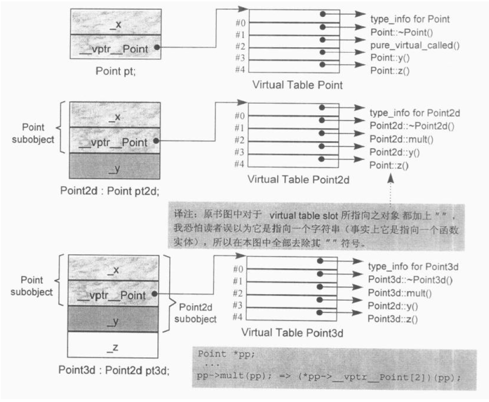
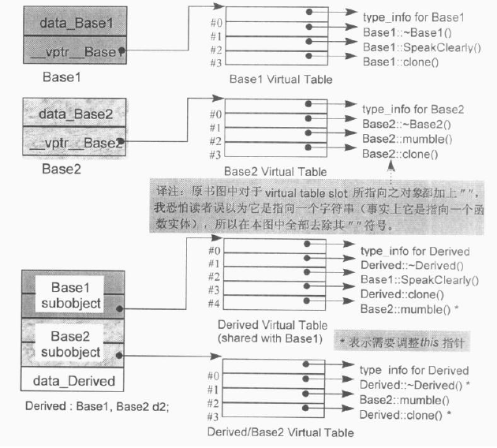
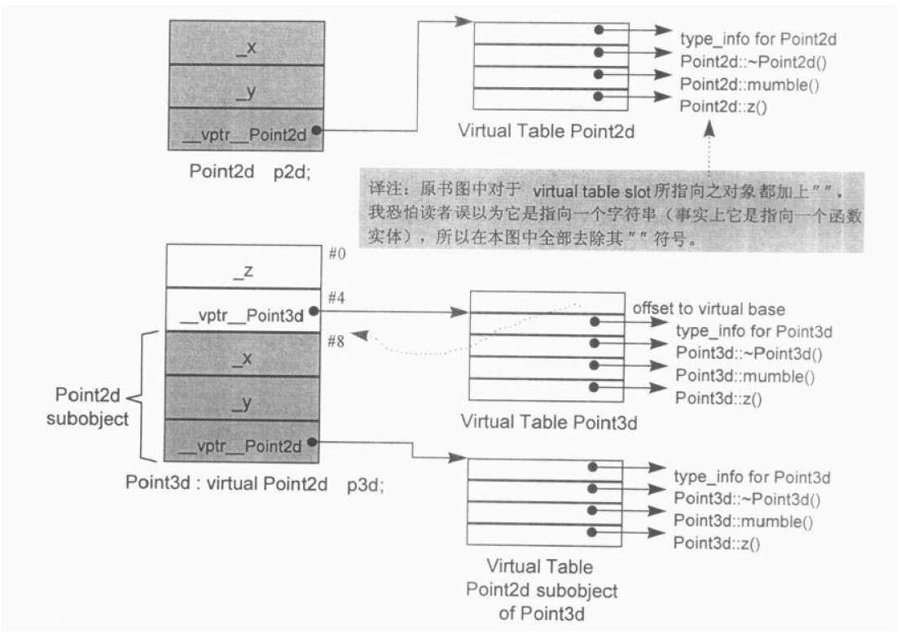

## 第 4 章  Function 语意学（The Semantics of Function）

### 4.1  Member 的各种调用方式

C++ 成员函数的三种类型：非静态、虚拟、静态。

#### Nonstatic Member Functions（非静态成员函数）

C++ 的设计准则之一就是：nonstatic member function 至少必须和一般的 nonmember function 有相同的效率。

**nonstatic member function 在调用时，会被转化为 nonmember function 的形式**，转化步骤如下：

1. 改写函数的 signature（译注:意指函数原型）以安插一个额外的参数到 member function 中，用以提供一个存取管道，使 class object 得以调用该函数。该额外参数被称为 this 指针：

    ```cpp
    // non-const nonstatic member 之增长过程 
    Point3d
    Point3d::magnitude(Point3d *const this)
    ```

    如果 member function 是 const，则变成：

    ```cpp
    // const nonstatic member 之扩张过程
    Point3d
    Point3d::magnitude(const Point3d *const this)
    ```

2. 将每一个 “对 nonstatic data member 的存取操作” 改为经由 this 指针来存取：

    ```cpp
    return sqrt(this->_x * this->_x + this->_y * this->_y + this->_z * this->_z);
    ```

3. 将 member function 重新写成一个外部函数，对函数名称进行 “mangling” 处理，使它在程序中成为独一无二的语汇:

    ```cpp
    extern magnitude__7Point3dFv(register Point3d *const this) ;
    ```

    现在这个函数已经被转换好了，而其每一个调用操作也都必须转换．于是:

    ```cpp
    obj.magnitude();
    // 变成了:
    magnitude__7Point3dFv(&obj);
    
    ptr->magnitude();
    // 变成了:
    magnitude__7Point3dFv(ptr);
    ```

函数内部被转化为：

```cpp
// 以下描述“named return value函数”的内部转化
// 使用C++伪码
void
normalize_7Point3dFv(register const Point3d *const this,Point3d &___result)
{
	register float mag = this->magnitude();
	// default constructor
	__result.Point3d::Point3d();
    
    __result._x = this->_x/mag;
    __result._y = this->_y/mag;
    __result._z = this->_z/mag;
	return;
}
```

**名称的特殊处理**

> 成员函数被转化为非成员函数，函数该如何命名呢？

- 一般而言，member 的名称前面会被加上 class 名称，形成独一无二的命名。

- 为避免多个重载函数实体拥有相同的名称，让它们独一无二，名称中再加上它们的参数链表（可以从函数原型中参考得到)。


#### Virtual Member Functions（虚拟成员函数）

如果 normalize() 是一个 virtual member function，那么以下的调用：

```cpp
ptr->normalize();
```

将会被内部转化为：

```cpp
*ptr->vptr[1])(ptr);
```

通过虚函数表、虚函数指针进行调用。


#### Static Member Functions（静态成员函数）

Static member functions 的主要特性就是它没有 this 指针。以下的次要特性统统根源于其主要特性：

- 它不能够直接存取其 class 中的 nonstatic members；
- 它不能够被声明为 const、 volatile 或 virtual；
- 它不需要经由 class object 才被调用

Static Member Functions 也被转化为一般的 nonmember 函数调用，如下：

```cpp
obj.normalize();
ptr->normalize();
// 转化为：
normalize_7Point3dsFv();
normalize_7Point3dsFV();
```

Static member function 由于缺乏 this 指针，因此差不多等同于 nonmember function。

**注意：**

如果 class 的设计者把 static data member 声明为 nonpublic（这一直被视为是一种好的习惯），那么他就必须提供一个或多个 member functions 来存取该 member。


### 4.2  Virtual Member Function （虚拟成员函数）

在C++中，多态 ( polymorphism) 表示 “以一个 public base class 的指针（或 reference )，寻址出一个 derived class object” 的意思。

Point class 体系中：

```cpp
class Point {
public:
	virtual ~Point ( ) ;
	virtual Point& multi(float) = 0 ;
    // ...其它操作
	float x() const { return _x; }
	virtual float y() const { return 0; }
    virtual float z() const { return 0; }
    // ...
protected :
	Point(float x = 0.0 );
    float _x;
} ;

// Point2d 继承 Point 并改写了虚函数
// Point3d 继承 Point2d 并改写了虚函数
```

单一继承下，Virtual Table 的布局：



现在，如果有这样的式子:

```cpp
ptr->z () ;
```

那么，如何有足够的知识在编译时期设定 virtual function 的调用呢？
一般而言，并不知道 ptr 所指对象的真正类型。然而知道，经由 ptr 可以存取到该对象的 virtual table。
虽然不知道哪一个 z() 函数实体会被调用，但我知道每一个 z() 函数地址都被放在 slot 4。这些信息使得编译器可以将该调用转化为：

```cpp
(*ptr->vpt:[4])(ptr);
```

现在不知道的就是 ptr 指向哪个实体，这将在执行期获得。


**多重继承下的 Virtual Function**




**虚拟继承下的 Virtual Function**




### 4.3  函数的效能

- nonmember 或 static member 或 nonstatic member 函数都被转化为完全相同的形式，所以三者的效率完全相同。

- 虚函数效率较前三者稍逊，多重继承效率次之，虚拟继承效率最低，随机继承深度的增加，效率会越来越低。


### 4.4  指向 Member Function 的指针（Pointer-to-Member Functions）


**支持 “指向 Virtual Member Functions” 的指针**


在多重继承之下，指向 Virtual Functions 的指针

“指向 Member Functions 之指针” 的效率

### 4.5  Inline Functions

形式参数（Formal Arguments）

局部变量（Local Variables）

### 本章小结